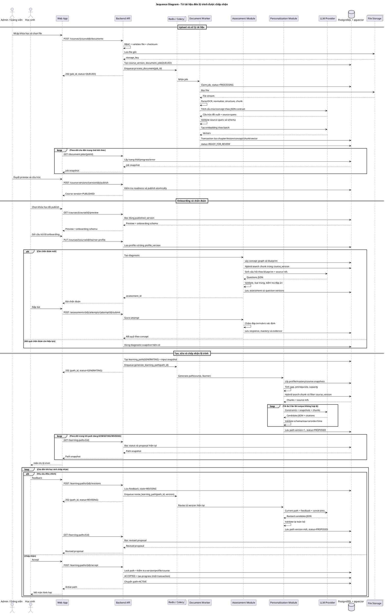
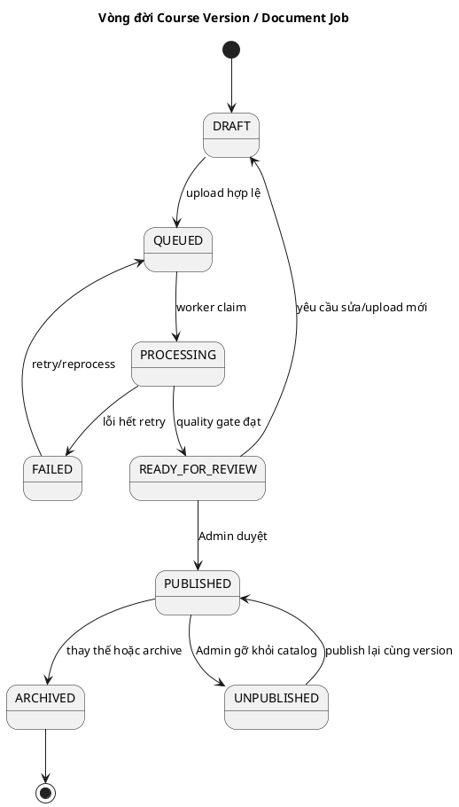
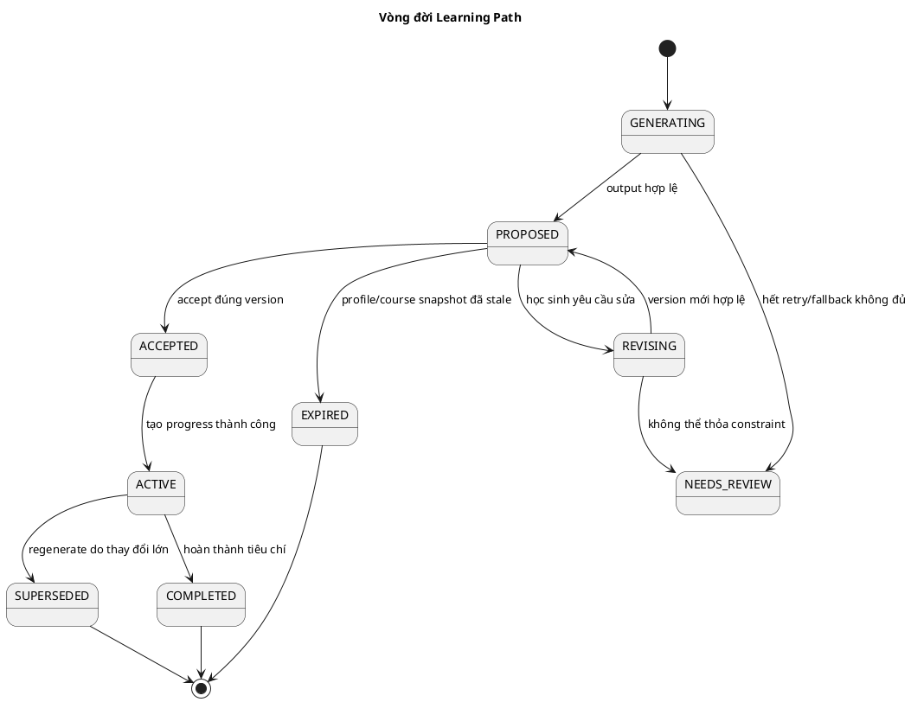

# Đặc tả logic hệ thống xây dựng lộ trình học tập cá nhân hóa

> Trạng thái: **Bản thiết kế logic - chờ xác nhận trước khi phát triển**
>
> Phiên bản: 1.0
>
> Ngày: 2026-07-30
>
> Phạm vi của tài liệu: từ Admin/Giảng viên đưa tài liệu vào hệ thống đến khi học sinh chấp nhận và bắt đầu lộ trình. Tài liệu này chưa bao gồm code triển khai.

## 1. Mục tiêu

Hệ thống phải biến tài liệu do Admin/Giảng viên cung cấp thành một khóa học có cấu trúc, đánh giá được năng lực đầu vào của học sinh, rồi tạo lộ trình phù hợp với kiến thức, mục tiêu, sở thích và quỹ thời gian của từng người.

Các nguyên tắc bắt buộc:

1. Tài liệu chưa xử lý xong hoặc chưa được duyệt không được hiển thị cho học sinh.
2. Nội dung, câu hỏi và lộ trình phải truy vết được về đúng khóa học, phiên bản tài liệu, chương/bài và đoạn nguồn.
3. LLM chỉ tạo đầu ra có cấu trúc. Backend luôn kiểm tra schema, phạm vi nguồn, điều kiện tiên quyết và giới hạn thời gian trước khi lưu hoặc hiển thị.
4. Câu hỏi đóng được chấm bằng đáp án/rubric đã lưu. Không dùng LLM làm nguồn quyết định duy nhất cho điểm số.
5. Xử lý tài liệu và gọi LLM là tác vụ bất đồng bộ, có trạng thái, retry giới hạn và lỗi có thể quan sát được.
6. Mỗi lộ trình gắn với phiên bản hồ sơ học sinh, kết quả chẩn đoán và phiên bản khóa học đã dùng để tạo nó.
7. Học sinh phải chấp nhận lộ trình trước khi hệ thống khởi tạo tiến độ học chính thức.

## 2. Hiện trạng repository

Repository hiện là một modular monolith gồm React, FastAPI, Celery/Redis và PostgreSQL có extension `pgvector`.

| Năng lực | Hiện trạng | Phần còn thiếu |
|---|---|---|
| Xác thực và phân quyền | Đã có `student`, `teacher`, `admin`; backend có guard theo role | Frontend chưa có nghiệp vụ tài liệu cho teacher/admin |
| Hồ sơ học sinh | Đã có hồ sơ học tập, mục tiêu, lịch học, sở thích và phiên bản hồ sơ | Chưa ràng buộc hồ sơ với từng khóa học/onboarding cụ thể |
| Hiểu đầu vào tự do | Đã có LLM trích xuất hồ sơ JSON và validate bằng Pydantic | Chưa có hội thoại onboarding theo khóa học |
| Mastery | Đã lưu mastery theo `topic_id` và cập nhật từ learning event | Chưa có topic/concept chính thức lấy từ tài liệu khóa học |
| Roadmap | Đã có bộ lập lịch xác định theo knowledge graph, mastery, deadline và quỹ thời gian | Khái niệm hiện do học sinh nhập tay; chưa lấy từ khóa học; chưa có accept/revise/version/progress |
| Worker | Đã có Celery/Redis và job kiểm tra mẫu | Chưa có pipeline xử lý tài liệu thực tế |
| Vector DB | PostgreSQL đã bật `pgvector` | Chưa có bảng chunk, embedding hoặc truy xuất RAG |
| Tài liệu/khóa học | Chưa có | Cần toàn bộ model, API, worker và UI |
| Khảo sát/chẩn đoán | Chưa có quy trình nghiệp vụ | Cần bộ câu hỏi, assessment, attempt, response và scoring |

Kết luận: nên mở rộng modular monolith hiện tại bằng các module nghiệp vụ rõ ràng. Chưa cần tách thành nhiều microservice vật lý; các “service” trong diagram là ranh giới logic và có thể tách sau khi có nhu cầu vận hành thực tế.

## 3. Phạm vi và vai trò

### 3.1. Vai trò

| Vai trò | Quyền chính |
|---|---|
| Admin | Tạo khóa học, upload/thay thế tài liệu, xem lỗi xử lý, duyệt, publish, unpublish và archive |
| Giảng viên | Tương tự Admin đối với khóa học được phân công; không quản trị người dùng/hệ thống |
| Học sinh | Xem khóa học đã publish, làm onboarding và chẩn đoán, xem/yêu cầu sửa/chấp nhận lộ trình, học và ghi nhận tiến độ |
| Worker | Trích xuất, OCR, chuẩn hóa, phân đoạn, tạo embedding và cập nhật trạng thái job |
| LLM | Tạo cấu trúc/câu hỏi/nội dung lộ trình theo contract; không trực tiếp ghi database |

### 3.2. Ngoài phạm vi phiên bản đầu

- Thanh toán, chứng chỉ và lớp học trực tuyến.
- Tự động crawl tài liệu từ Internet.
- Đồng bộ LMS bên thứ ba.
- Tạo video hoặc audio bằng AI.
- Tự động publish tài liệu mà không qua bước kiểm tra của Admin/Giảng viên.

## 4. Kiến trúc logic mục tiêu

```text
React App
   |
FastAPI API
   |-- Auth/RBAC
   |-- Course & Document module -------- File Storage
   |-- Onboarding & Assessment module
   |-- Personalization module
   |-- Learning Progress module
   |
   |-- PostgreSQL (nghiệp vụ + pgvector)
   |-- Redis/Celery queue
              |
          Celery Worker
              |-- Parser/OCR
              |-- Chunking/Embedding
              |-- LLM provider
```

Quyết định kiến trúc:

- PostgreSQL là nguồn dữ liệu chuẩn. Vector là chỉ mục phục vụ truy xuất, có thể tái tạo từ chunk gốc.
- File Storage lưu file gốc; local volume chỉ dùng cho development. Production dùng object storage tương thích S3.
- API tạo `document_job` rồi trả `202 Accepted`; worker xử lý ở nền. Không giữ HTTP request trong suốt quá trình OCR/embedding.
- Mỗi lần thay tài liệu tạo `course_version` mới. Phiên bản đã publish và đang có học sinh sử dụng không bị sửa nội dung tại chỗ.
- Bộ lập kế hoạch hiện có tiếp tục phụ trách prerequisite, mastery, deadline và capacity. LLM bổ sung nội dung sư phạm trong các giới hạn đó, không tự ý thay đổi knowledge graph.

## 5. Luồng hoạt động tổng thể

Diagram này thay cho Luồng 1 ban đầu. Nó bổ sung bước xử lý bất đồng bộ, kiểm duyệt trước publish, retry có giới hạn, chẩn đoán có điều kiện và vòng lặp revise/accept rõ ràng.

```plantuml
@startuml
title Quy trình tối ưu xây dựng lộ trình học tập cá nhân hóa

skinparam backgroundColor #FFFFFF
skinparam shadowing false
skinparam activity {
  BackgroundColor #F4F7FB
  BorderColor #3C4F65
  FontColor #1F2937
  DiamondBackgroundColor #FFF4CC
  DiamondBorderColor #D69E2E
  StartColor #2F855A
  EndColor #C53030
}

start

partition "Admin / Giảng viên" {
  :Đăng nhập và tạo khóa học bản nháp;
  :Nhập môn học, khối lớp, tên, mô tả;
  :Upload tài liệu;
}

partition "API / Document Service" {
  :Xác thực quyền, MIME, dung lượng,
  checksum và chống file nguy hiểm;
  if (File hợp lệ?) then (Có)
    :Lưu file gốc và course_version;
    :Tạo document_job = QUEUED;
    :Trả job_id để theo dõi;
  else (Không)
    :Trả lỗi có mã và hướng dẫn sửa;
    stop
  endif
}

partition "Worker xử lý tài liệu" {
  :Nhận job và khóa chống xử lý trùng;
  :Trích xuất text; OCR nếu cần;
  :Chuẩn hóa văn bản và loại nội dung rác;
  :Bóc tách chương, bài, mục tiêu và concept;
  fork
    :Tạo preview;
  fork again
    :Tạo metadata, keyword và source reference;
  fork again
    :Chunk theo ranh giới ngữ nghĩa;
    :Tạo embedding theo batch;
    :Lưu chunk và vector;
  end fork
  :Kiểm tra độ phủ, thứ tự và chất lượng trích xuất;
  if (Xử lý đạt yêu cầu?) then (Có)
    :Đặt phiên bản = READY_FOR_REVIEW;
  else (Không)
    :Ghi lỗi, bước lỗi và số lần thử;
    :Đặt job = FAILED;
    stop
  endif
}

partition "Admin / Giảng viên" {
  :Xem preview, cấu trúc và cảnh báo;
  if (Duyệt nội dung?) then (Có)
    :Publish phiên bản khóa học;
  else (Không)
    :Sửa metadata hoặc upload phiên bản mới;
    stop
  endif
}

partition "Học sinh" {
  :Đăng nhập;
  :Xem danh sách khóa học đã publish;
  :Chọn khóa học và xem preview;
  if (Bắt đầu học?) then (Có)
    :Bắt đầu onboarding;
  else (Không)
    :Quay lại danh sách khóa học;
    stop
  endif
  :Trả lời mục tiêu, lịch học và sở thích;
}

partition "Onboarding / Assessment Service" {
  :Validate và lưu learner-course profile;
  if (Đủ dữ liệu đáng tin cậy?) then (Có)
    :Dùng kết quả chẩn đoán còn hiệu lực;
  else (Không)
    :Tạo đề chẩn đoán phủ các concept chính;
  endif
}

partition "Học sinh" {
  if (Có bài chẩn đoán mới?) then (Có)
    :Làm và nộp bài chẩn đoán;
  endif
}

partition "Assessment Service" {
  if (Có bài chẩn đoán mới vừa nộp?) then (Có)
    :Chấm theo đáp án/rubric;
    :Tính mastery, confidence và misconception;
    :Lưu attempt, response và evidence;
  else (Không)
    :Nạp mastery snapshot còn hiệu lực;
  endif
}

partition "Personalization Service" {
  :Chụp snapshot hồ sơ, mastery
  và course_version;
  :Xác định gap, prerequisite và capacity;
  :Truy xuất đúng chunk theo course_version;
  :Tạo candidate bằng LLM theo JSON contract;
  :Validate schema, nguồn, thứ tự,
  thời lượng và tiêu chí hoàn thành;
  if (Candidate hợp lệ sau tối đa 3 lần?) then (Có)
    :Lưu lộ trình = PROPOSED;
  else (Không)
    :Tạo kế hoạch tối thiểu bằng planner xác định;
    if (Kế hoạch tối thiểu hợp lệ?) then (Có)
      :Lưu fallback = PROPOSED;
    else (Không)
      :Chuyển trạng thái NEEDS_REVIEW;
      stop
    endif
  endif
}

repeat
  partition "Học sinh" {
    :Xem lộ trình và nguồn tham chiếu;
    if (Chấp nhận?) then (Có)
      :Xác nhận lộ trình;
    else (Điều chỉnh)
      :Nhập phản hồi có cấu trúc hoặc tự do;
    endif
  }
  partition "Personalization Service" {
    if (Có yêu cầu điều chỉnh?) then (Có)
      :Lưu revision request;
      :Tạo phiên bản mới trong cùng giới hạn;
      :Validate và đặt lại PROPOSED;
    else (Không)
      :Đánh dấu ACCEPTED;
    endif
  }
repeat while (Chưa chấp nhận?) is (Có) not (Không)

partition "Learning Progress Service" {
  :Khởi tạo progress theo từng path item;
  :Chuyển lộ trình thành ACTIVE;
}

partition "Học sinh" {
  :Bắt đầu học theo lộ trình;
}

stop
@enduml
```



## 6. Sequence diagram

Diagram này thay cho Luồng 2 ban đầu. Các participant “Service” là module logic trong backend hiện tại; queue/worker mới là ranh giới xử lý nền.



## 7. Quy trình chi tiết theo bước

### 7.1. A - Tạo và publish nội dung khóa học

| Bước | Chủ thể | Xử lý | Kết quả/điều kiện |
|---|---|---|---|
| A01 | Admin/Giảng viên | Tạo course draft với môn, khối, tên, mô tả | `course.status=DRAFT` |
| A02 | API | Kiểm tra quyền sở hữu/phân công | Sai quyền trả `403` |
| A03 | API | Kiểm tra extension, MIME thực, kích thước, checksum và file nguy hiểm | File lỗi không được lưu thành document hợp lệ |
| A04 | API | Lưu file bằng generated key, không dùng trực tiếp tên người dùng | Có `storage_key`, `checksum` |
| A05 | API | Tạo `course_version`, `document`, `document_job` trong transaction | Job `QUEUED`, trả `202` |
| A06 | Worker | Claim job idempotently; parse text, OCR trang không có text | Job `PROCESSING` và có progress |
| A07 | Worker | Chuẩn hóa Unicode/whitespace/header-footer; giữ mapping trang/vị trí nguồn | Text có source span |
| A08 | Worker | Bóc chương, bài, heading, learning objective, concept và prerequisite | Cấu trúc có thứ tự, không cycle |
| A09 | Worker | Tạo preview, chunk và metadata | Mỗi chunk thuộc đúng lesson/version |
| A10 | Worker | Tạo embedding theo batch và lưu pgvector | Vector count khớp chunk cần index |
| A11 | Worker | Chạy quality gate | Đạt thì `READY_FOR_REVIEW`, lỗi thì `FAILED` |
| A12 | Admin/Giảng viên | Xem preview, sửa metadata/cấu trúc được phép và duyệt | Chỉ readiness hợp lệ mới được publish |
| A13 | API | Publish atomically và cập nhật `published_version_id` | Học sinh chỉ nhìn thấy bản `PUBLISHED` |

Quality gate tối thiểu:

- Có tiêu đề khóa học, ít nhất một chương, một bài và một chunk có nội dung.
- Tỉ lệ trang trích xuất được vượt ngưỡng cấu hình; trang OCR lỗi được liệt kê.
- Mọi lesson/chunk có source reference; không có chunk nằm ngoài course version.
- Concept ID duy nhất trong phiên bản; prerequisite không trỏ tới concept không tồn tại và không tạo cycle.
- Không publish nếu embedding còn thiếu, trừ khi hệ thống chủ động chạy ở chế độ không RAG và hiển thị cảnh báo cho Admin.

### 7.2. B - Onboarding theo khóa học

| Bước | Xử lý | Quy tắc |
|---|---|---|
| B01 | Học sinh chọn khóa học đã publish | Chụp `course_version_id`; không dùng draft mới nhất |
| B02 | Hệ thống lấy learner profile chung và course profile gần nhất | Dữ liệu course-specific được ưu tiên cho khóa học hiện tại |
| B03 | Học sinh trả lời mục tiêu, deadline, phút/ngày, ngày/tuần, khung giờ và format ưa thích | Trường bắt buộc được validate cả client lẫn server |
| B04 | Hệ thống phát hiện thiếu hoặc mâu thuẫn | Không âm thầm đoán; yêu cầu xác nhận thông tin quan trọng |
| B05 | Lưu profile mới | Tăng `profile_version` khi dữ liệu ảnh hưởng lộ trình thay đổi |

Điều kiện đủ để tạo lộ trình: có khóa học, mục tiêu, ngày bắt đầu/deadline, `minutes_per_day`, `days_per_week`, ít nhất một format học phù hợp và mastery đủ tin cậy hoặc một diagnostic mới.

### 7.3. C - Tạo và chấm bài chẩn đoán

1. Assessment blueprint phân bổ câu hỏi theo concept, độ khó và trọng số. Concept nền tảng/tiên quyết phải được phủ trước.
2. Hệ thống truy xuất chunk theo `course_version_id`, `concept_id` và lesson; không dùng kết quả ngoài khóa học.
3. LLM có thể sinh câu hỏi, distractor và giải thích, nhưng phải trả `source_refs`, đáp án và độ khó theo schema.
4. Validator loại câu trùng, câu không có đáp án, citation sai, đáp án không được nguồn hỗ trợ hoặc nội dung vượt cấp.
5. Khi học sinh bắt đầu, hệ thống đóng băng `assessment_version`; thay đổi question bank không làm đổi bài đang làm.
6. Khi submit, endpoint dùng idempotency key và chỉ chấp nhận một lần. Câu đóng chấm xác định; câu tự luận dùng rubric và có cờ confidence/manual review nếu cần.
7. Mastery được cập nhật theo từng concept cùng evidence, confidence và thời điểm. Không đồng nhất “không trả lời” với “trả lời sai” nếu timeout/hệ thống lỗi.

Diagnostic được coi là hết hiệu lực khi có một trong các điều kiện: course version thay đổi đáng kể, profile mục tiêu thay đổi, quá thời hạn cấu hình hoặc học sinh đã có đủ learning evidence mới làm thay đổi mastery.

### 7.4. D - Tạo lộ trình cá nhân hóa

Quy trình dùng mô hình hybrid:

1. Backend chụp snapshot `profile_version`, `diagnostic_attempt_id`, mastery và `course_version_id`.
2. Planner xác định concept đích từ mục tiêu; mở rộng prerequisite theo knowledge graph.
3. Concept đã đạt mastery yêu cầu được skip có lý do; prerequisite yếu được ưu tiên cao hơn.
4. Planner tính tổng capacity từ deadline, phút/ngày, ngày/tuần và lịch khả dụng. Nếu không thể đạt mục tiêu, hệ thống phải báo trade-off, không tạo lịch giả khả thi.
5. RAG lấy nội dung phù hợp bằng hybrid search (metadata/filter + vector), giới hạn đúng course version.
6. LLM tạo nội dung buổi học, hoạt động, bài tập và tiêu chí hoàn thành trong khung thứ tự/thời gian do planner cấp.
7. Validator kiểm tra JSON schema, concept/source tồn tại, prerequisite, tổng thời lượng, ngày học, mục tiêu, duplicate và nội dung bị cấm.
8. Output lỗi được retry tối đa 3 lần với lỗi validation cụ thể. Sau đó dùng roadmap tối thiểu do planner tạo hoặc `NEEDS_REVIEW`; không lưu output lỗi thành proposal.
9. Lưu proposal và toàn bộ input snapshot/prompt version/model version cần thiết để audit và tái hiện.

### 7.5. E - Revise, accept và khởi tạo tiến độ

- Mỗi yêu cầu revise là bản ghi bất biến gồm feedback, tác giả, path version nguồn và thời điểm.
- Revision không được làm mất các constraint cứng. Nếu feedback mâu thuẫn deadline/capacity, hệ thống trả giải thích và các lựa chọn khả thi.
- Mỗi output hợp lệ tạo path version mới. Version cũ giữ lại để audit nhưng không chỉnh sửa tại chỗ.
- Accept dùng optimistic concurrency: client gửi `path_version`; nếu proposal đã đổi, trả `409` để người dùng xem bản mới.
- Accept và tạo progress diễn ra trong một database transaction. Gọi lặp với cùng idempotency key không tạo progress trùng.
- Nếu profile hoặc course version đổi sau lúc generate, hệ thống cảnh báo/stale path và yêu cầu regenerate trước accept khi thay đổi ảnh hưởng nội dung.

## 8. State machine

### 8.1. Vòng đời phiên bản tài liệu



### 8.2. Vòng đời lộ trình



Không cho phép client tự gửi trạng thái tùy ý. Mỗi transition là một command backend có kiểm tra role, trạng thái nguồn và invariant.

## 9. Mô hình dữ liệu khái niệm

### 9.1. Nội dung khóa học

| Entity | Trường/quan hệ quan trọng |
|---|---|
| `courses` | owner, subject, grade, title, description, status, `published_version_id` |
| `course_versions` | course, version number, processing status, published/created metadata |
| `documents` | course version, storage key, original name, MIME, size, checksum |
| `document_jobs` | document, status, progress, current step, retry count, error code/detail |
| `chapters` / `lessons` | course version, parent, order, title, preview, source span |
| `concepts` | course version, stable key, title, description, difficulty, estimated minutes |
| `concept_prerequisites` | concept, prerequisite concept; unique pair, không cycle |
| `content_chunks` | lesson, course version, text, order, token count, page/source span, metadata, embedding |

### 9.2. Đánh giá và cá nhân hóa

| Entity | Trường/quan hệ quan trọng |
|---|---|
| `learner_course_profiles` | learner, course, goal/schedule/preferences, profile version |
| `assessments` | course version, blueprint, source, status, version |
| `questions` | assessment version, concept, type, prompt, options, answer/rubric, source refs |
| `assessment_attempts` | learner, assessment version, started/submitted timestamps, status, score |
| `assessment_responses` | attempt, question, answer, correctness, score, evidence |
| `learner_topic_mastery` | đã có; cần ràng buộc topic với concept/version hoặc stable concept key |
| `learning_paths` | learner, course/version, status, version, profile/mastery snapshot, totals |
| `learning_path_items` | path version, concept/lesson, sequence, schedule, activity, criteria, source refs |
| `learning_path_revisions` | path/version nguồn, feedback, normalized constraints, result version |
| `learning_progress` | accepted path item, status, started/completed timestamp, evidence |

Không lưu đáp án đúng trong payload gửi xuống client trước khi submit. Dữ liệu audit nhạy cảm và prompt/output thô cần chính sách retention, phân quyền truy cập và loại bỏ PII không cần thiết.

## 10. API contract dự kiến

Đây là contract định hướng cho bước code; tên cuối cùng có thể điều chỉnh nhưng semantics và status code phải giữ nhất quán.

| Method và endpoint | Role | Thành công | Mục đích |
|---|---|---|---|
| `POST /courses` | Teacher/Admin | `201` | Tạo course draft |
| `POST /courses/{id}/documents` | Teacher/Admin | `202` | Upload, tạo version và job |
| `GET /document-jobs/{job_id}` | Owner/Admin | `200` | Xem progress/error |
| `GET /course-versions/{id}/review` | Owner/Admin | `200` | Xem preview/cấu trúc/cảnh báo |
| `POST /course-versions/{id}/publish` | Owner/Admin | `200` | Publish nếu đạt readiness |
| `GET /courses` | Student | `200` | Chỉ trả khóa học published phù hợp |
| `GET /courses/{id}/preview` | Student | `200` | Preview published version |
| `PUT /courses/{id}/learner-profile` | Student | `200` | Upsert onboarding course-specific |
| `POST /courses/{id}/diagnostics` | Student | `201/202` | Tạo hoặc cấp bài chẩn đoán |
| `POST /assessments/{id}/attempts` | Student | `201` | Bắt đầu immutable attempt |
| `POST /assessments/{id}/attempts/{attempt_id}/submit` | Student | `200` | Submit idempotent và chấm bài |
| `POST /courses/{id}/learning-paths` | Student | `202` | Tạo path generation job |
| `GET /learning-paths/{id}` | Owner | `200` | Xem proposal/version hiện tại |
| `POST /learning-paths/{id}/revisions` | Owner | `202` | Gửi feedback và tạo version mới |
| `POST /learning-paths/{id}/accept` | Owner | `200` | Accept đúng version, tạo progress |

Quy ước lỗi:

- `400`: request không đúng định dạng nghiệp vụ cơ bản.
- `401/403`: chưa xác thực/không đúng role hoặc owner.
- `404`: tài nguyên không tồn tại hoặc không được phép lộ sự tồn tại.
- `409`: checksum/job trùng, state transition sai hoặc version conflict.
- `413/415/422`: file quá lớn, MIME không hỗ trợ, dữ liệu/constraint không hợp lệ.
- `429`: vượt quota upload/LLM.
- `502/503`: provider bên ngoài lỗi hoặc dịch vụ tạm chưa cấu hình.

Mọi lỗi nghiệp vụ trả cấu trúc ổn định: `code`, `message`, `field_errors`, `retryable`, `correlation_id`.

## 11. Contract LLM/RAG

### 11.1. Context được phép gửi khi tạo lộ trình

- Course/version metadata và knowledge graph đã validate.
- Learner profile snapshot tối thiểu cần thiết.
- Mastery/gap snapshot và diagnostic summary, không gửi PII không liên quan.
- Constraint cứng từ planner: concept order, available minutes/dates, deadline.
- Chunks đã truy xuất cùng `chunk_id`, lesson/concept và source reference.
- Prompt/schema version.

### 11.2. Output tối thiểu

```json
{
  "summary": "string",
  "outcomes": ["string"],
  "items": [
    {
      "concept_id": "string",
      "lesson_id": "uuid",
      "title": "string",
      "objective": "string",
      "planned_date": "YYYY-MM-DD",
      "estimated_minutes": 45,
      "activity_type": "reading|worked_example|guided_practice|quiz|review",
      "instructions": "string",
      "completion_criteria": ["string"],
      "source_chunk_ids": ["uuid"]
    }
  ]
}
```

Validator phải từ chối output nếu có ID không tồn tại, citation ngoài course version, thiếu prerequisite, tổng thời gian vượt capacity, ngày sau deadline, schema sai hoặc text rỗng. Nội dung do LLM sinh không bao giờ được dùng để tạo SQL/filter trực tiếp.

## 12. Xử lý lỗi, retry và tính nhất quán

| Tình huống | Hành vi yêu cầu |
|---|---|
| Upload lại cùng checksum | Trả document/job hiện có hoặc tạo version theo lựa chọn rõ ràng; không xử lý trùng âm thầm |
| Worker chết giữa chừng | Job lease hết hạn cho phép worker khác resume; các bước ghi idempotent |
| Parser/OCR lỗi một phần | Lưu page-level warning; quality gate quyết định review hay failed |
| Embedding provider lỗi | Exponential backoff có jitter, giới hạn retry; không publish index thiếu |
| LLM timeout/JSON lỗi | Retry giới hạn; lưu error code, không lưu candidate lỗi |
| Submit assessment lặp | Idempotency key trả lại kết quả cũ, không chấm/cập nhật mastery hai lần |
| Hai request revise đồng thời | Optimistic version check; request cũ nhận `409` |
| Accept trong lúc profile/course đổi | Đánh dấu stale và yêu cầu regenerate hoặc xác nhận theo policy |
| DB thành công nhưng enqueue lỗi | Outbox pattern hoặc transaction-aware dispatcher để job không bị mất |

## 13. Bảo mật và vận hành

- Kiểm tra cả extension, MIME sniffing và signature; giới hạn PDF, DOCX, PPTX, TXT và ảnh cấu hình. Chặn executable, archive lồng và path traversal.
- Có quota theo user/course, rate limit, timeout và giới hạn số trang/token.
- RBAC đi cùng ownership; Teacher không sửa khóa học ngoài phạm vi được giao.
- File gốc private; preview/download dùng authorization hoặc URL ký có thời hạn.
- Mã hóa secret bằng environment/secret manager; không ghi API key, token, PII hoặc toàn văn tài liệu vào log.
- Prompt injection trong tài liệu được xem là dữ liệu, không phải instruction. System prompt cấm tài liệu thay đổi tool/policy và output chỉ theo schema.
- Log có `correlation_id`, `job_id`, `course_version_id`, `learner_id` đã pseudonymize, provider/model/prompt version, latency, token/cost và validation error.
- Metrics tối thiểu: queue age, processing duration, extraction coverage, chunk/vector count, LLM failure/validation/retry rate, diagnostic completion, path acceptance/revision rate.

## 14. Tiêu chí nghiệm thu chức năng

### 14.1. Tài liệu và khóa học

- `DOC-01`: File không hỗ trợ/quá dung lượng bị từ chối trước khi enqueue.
- `DOC-02`: Upload hợp lệ trả `202` và job chuyển tuần tự `QUEUED -> PROCESSING -> READY_FOR_REVIEW` hoặc `FAILED`.
- `DOC-03`: Retry/job delivery lặp không tạo chapter, lesson, chunk hoặc vector trùng.
- `DOC-04`: Mọi preview/chunk truy vết được về trang/đoạn nguồn.
- `DOC-05`: Học sinh không thấy draft, failed, ready-for-review hoặc unpublished version.
- `DOC-06`: Course chỉ publish khi vượt quality gate và được người có quyền duyệt.

### 14.2. Khảo sát và đánh giá

- `ASM-01`: Không tạo lộ trình nếu thiếu trường profile bắt buộc.
- `ASM-02`: Diagnostic phủ concept theo blueprint và câu hỏi đều có source ref hợp lệ.
- `ASM-03`: Submit lặp không đổi điểm/mastery lần thứ hai.
- `ASM-04`: Mastery và evidence được lưu theo concept sau khi chấm.
- `ASM-05`: Client không nhận đáp án đúng trước submit.

### 14.3. Lộ trình

- `PATH-01`: Prerequisite chưa đạt luôn đứng trước concept đích.
- `PATH-02`: Concept đã đạt ngưỡng được skip và có lý do.
- `PATH-03`: Mỗi session không vượt phút/ngày và không vượt deadline/lịch khả dụng.
- `PATH-04`: Mọi nội dung đọc/bài tập có source thuộc đúng published course version.
- `PATH-05`: Output LLM sai schema/citation/constraint không được hiển thị hoặc lưu thành proposal.
- `PATH-06`: Revision tạo version mới và giữ version cũ để audit.
- `PATH-07`: Accept version cũ trả `409`; accept hợp lệ tạo đúng một bộ progress.
- `PATH-08`: Sau accept, path chuyển `ACTIVE` và học sinh mở được buổi học đầu tiên.

## 15. Chiến lược test cho bước phát triển

| Tầng test | Nội dung |
|---|---|
| Unit | File validators, parser normalizer, chunk boundary, concept graph/cycle, mastery, capacity, state transition, LLM schema validator |
| Integration | PostgreSQL/pgvector query, storage, Celery job idempotency, outbox, publish transaction, assessment submit, accept transaction |
| Contract | Mock parser/embedding/LLM với JSON đúng, sai schema, timeout, citation giả và partial response |
| API/RBAC | Role/ownership, status code, upload limits, version conflict, idempotency |
| End-to-end | Admin upload -> review -> publish -> student onboarding -> diagnostic -> proposal -> revise -> accept -> first lesson |
| Security | MIME spoofing, malicious filename, prompt injection document, unauthorized file/preview, answer leakage |
| Performance | Tài liệu lớn trong giới hạn, batch embedding, concurrent jobs, vector search latency và queue backpressure |

Không gọi provider LLM thật trong test mặc định. Dùng fake provider cố định để test có thể lặp lại; smoke test provider thật là suite riêng, có quota và chỉ chạy thủ công/CI được bảo vệ.

## 16. Thứ tự phát triển sau khi duyệt tài liệu

Mỗi giai đoạn thực hiện theo chu kỳ: **giải pháp chi tiết -> code -> automated test -> dừng để người dùng test/xác nhận**.

1. **Nền tảng nội dung**: course/version/document/job schema, upload/storage, Celery pipeline khung, status API và Admin UI.
2. **Phân tích và RAG**: parser/OCR adapter, structure/chunk/source ref, embedding/pgvector, quality review và publish.
3. **Catalog và onboarding**: Student course list/preview, learner-course profile và validation.
4. **Diagnostic assessment**: blueprint, question generation/validation, attempt, scoring, mastery/evidence.
5. **Personalized path**: nối concept graph của course vào planner hiện có, RAG context, LLM contract/validator, proposal UI.
6. **Revision, acceptance và progress**: versioning, feedback loop, concurrency/idempotency, first learning session.
7. **Hardening**: security, observability, retry/outbox, performance và end-to-end regression.

Không bắt đầu giai đoạn 1 cho đến khi tài liệu logic này được xác nhận hoặc các điểm cần chỉnh đã được thống nhất.

## 17. Các giả định cần xác nhận

1. Version đầu hỗ trợ PDF, DOCX, PPTX, TXT và ảnh scan; video/audio không thuộc phạm vi.
2. Admin và Giảng viên đều có thể quản lý nội dung, nhưng Giảng viên chỉ quản lý khóa học được phân công.
3. Mọi course version phải được con người duyệt trước publish.
4. PostgreSQL + pgvector tiếp tục được dùng thay vì thêm một Vector Database riêng ở giai đoạn đầu.
5. Roadmap planner xác định thứ tự/thời lượng; LLM chỉ tạo nội dung sư phạm có citation.
6. Chẩn đoán mặc định bắt buộc cho lần học đầu tiên, trừ khi có kết quả còn hiệu lực theo đúng course/concept version.
7. Học sinh có thể revise nhiều lần, nhưng hệ thống áp quota/rate limit và không nới constraint cứng không khả thi.
8. Khi course version mới được publish, lộ trình đang active vẫn giữ version cũ; hệ thống đề xuất migrate/regenerate thay vì tự đổi nội dung.

Các giả định trên là điểm chốt trước khi chuyển sang thiết kế database/API chi tiết và code.
